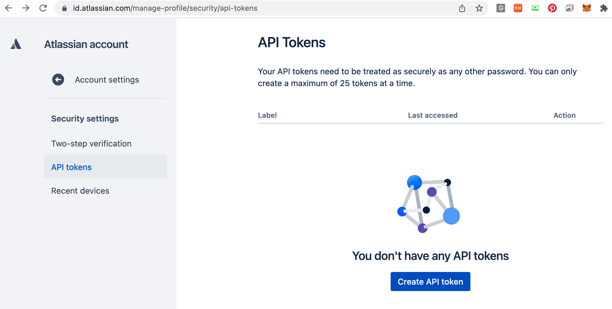
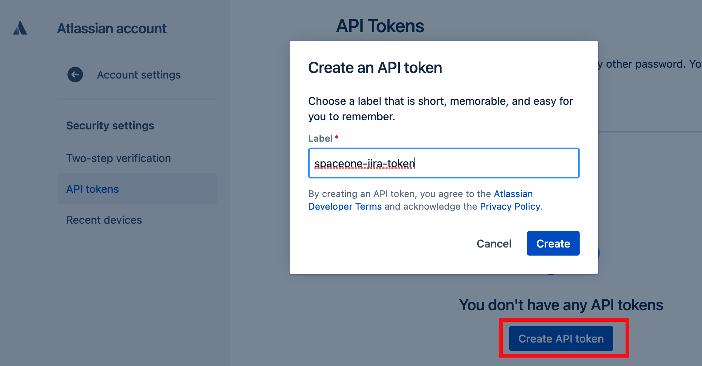
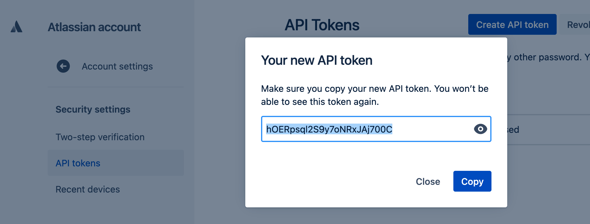
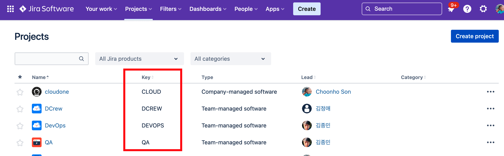
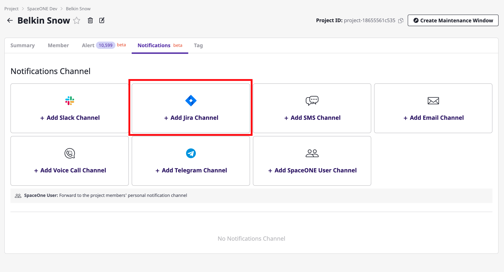
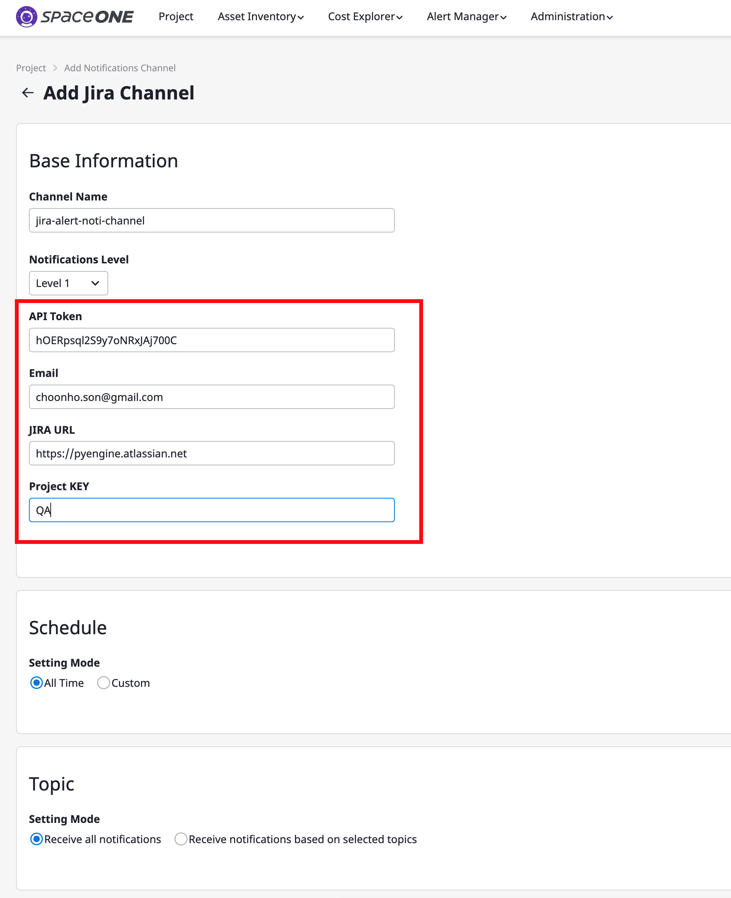
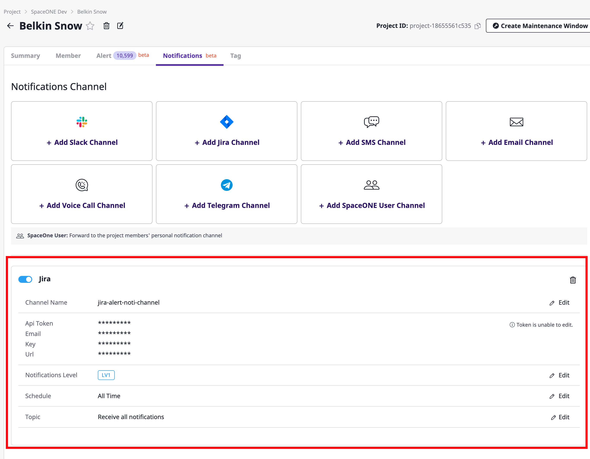

# JIRA Notification Plugin

JIRA notificaiton plugin delivers SpaceONE alert to Jira Issue Ticket.

To use JIRA Notification Plugin, you needs JIRA credentials

* API Token
* JIRA API Server URL
* Email
* Key

# Create JIRA credentials

Reference: https://support.atlassian.com/atlassian-account/docs/manage-api-tokens-for-your-atlassian-account/

## Create JIRA API-TOKEN

url: https://id.atlassian.com/manage-profile/security/api-tokens

Create New API TOKEN. Label is any string what you want.

Remember API TOKEN

## JIRA API Server URL

If you use Atlassian JIRA SaaS Service, your default url is

***https://{your jira home}.atlassian.net***

If you use on-premise JIRA S/W, contact your JIRA administrator.

## Email

Email is your jira login ID.
This is owner of API-TOKEN.

## Key

Key is your JIRA project name which want to create JIRA ticket.

In this example, we want to create JIRA ticket at QA project.
The Key is ***QA***.

# Create JIRA notification channel

## Move to SpaceONE Project page.

## Create JIRA Notification Channel.

Put JIRA credentials from Step 1.

Check New JIRA channel is created.

